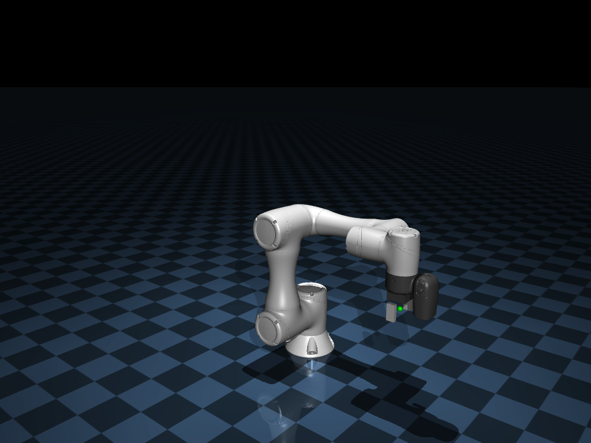

# Simulación del brazo robótico TM5-700 en MuJoCo

Entorno de MuJoCo para simular y controlar los brazos **Techman TM5-700** (6 GDL)
y **Franka Emika Panda** (7 GDL). Cada modelo se convirtió/adaptó a MJCF a partir
de sus repositorios de origen (ver [Fuentes de los modelos](#fuentes-de-los-modelos)).



## Organización del proyecto

```
MuJoCo/
├── robots/               # Paquete de robots (una clase por archivo)
│   ├── base.py           #   RobotArm (clase base genérica) + MJCF_DIR
│   ├── control.py        #   CartesianController (IK, movimiento por Δpose)
│   ├── structures.py     #   PoseDelta / Pose / Frame / CartesianAction
│   ├── factory.py        #   RobotFactory (registro/creación) + make_robot
│   ├── tm5.py            #   TM5 / TM5_700
│   └── panda.py          #   Panda
├── simulation.py         # Clase Simulation (simular, visualizar, grabar, observar)
├── simulate.py           # Script: elige un robot y abre el visor
├── record.py             # Script: graba un video del robot moviéndose
├── demo_pick.py          # Script: demo pick & place con move_delta + pinza
├── openvla_controller.py # Controlador de OpenVLA (imagen+texto → CartesianAction)
├── openvla_colab.ipynb   # Notebook para correr OpenVLA en Colab (GPU)
├── environment.yml       # Entorno conda
├── requirements.txt      # Dependencias (alternativa sin conda)
├── MJCF/                 # Modelos de los robots en formato MJCF (uno por carpeta)
│   ├── tm5-700/          #   tm5-700.xml + meshes/
│   └── panda/            #   scene.xml + panda.xml + assets/ + LICENSE
└── output/               # Imágenes y videos generados
```

- **`MJCF/<robot>/`** — cada robot vive en su **propia carpeta autocontenida**
  (su MJCF + sus mallas), en el formato XML nativo de MuJoCo. Solo se guardan los
  archivos necesarios para cargar cada robot; el origen de los modelos está en
  [Fuentes de los modelos](#fuentes-de-los-modelos).
- **`output/`** — todo lo que se genera (imágenes, videos) cae aquí por defecto.

## Robots disponibles

| Nombre | Clase | GDL | Notas |
|---|---|---|---|
| `tm5-700` | `TM5_700` | 6 | Techman TM5-700 (modelo propio) + pinza paralela. |
| `panda` | `Panda` | 7 | Franka Emika Panda (MuJoCo Menagerie) + pinza por tendón. |

```bash
python simulate.py --list                 # lista los robots
python simulate.py --robot panda          # abre el visor con el Panda
```

## Fuentes de los modelos

Los modelos MJCF de `MJCF/` se derivan de estos repositorios de origen. En este
proyecto solo se conservan los archivos necesarios para cargar cada robot.

| Robot | Origen | Repositorio |
|---|---|---|
| **TM5-700** | Descripción URDF + mallas del paquete ROS 2 de Techman (`tm_description`), convertidas a MJCF. | [TechmanRobotInc/tmr_ros2](https://github.com/TechmanRobotInc/tmr_ros2) |
| **Panda** | Modelo MJCF `franka_emika_panda` de MuJoCo Menagerie (DeepMind). Se incluye su `LICENSE` en `MJCF/panda/`. | [google-deepmind/mujoco_menagerie](https://github.com/google-deepmind/mujoco_menagerie) |

## Diseño: `RobotArm`, `CartesianController`, `RobotFactory` y `Simulation`

Las responsabilidades están separadas:

- **`RobotArm`** (`robots/base.py`) — _el robot_ (clase base genérica): su modelo,
  el estado de sus articulaciones, el control articular y la cinemática directa
  del efector. No sabe nada de IK, cámaras ni video.
- **`CartesianController`** (`robots/control.py`) — _el control cartesiano_: mueve
  el TCP por incrementos de pose resolviendo la IK. Se accede como
  `robot.controller`. Está separado del robot para poder intercambiar la
  estrategia (IK amortiguada, OSC, ...) sin tocar `RobotArm`.
- **`RobotFactory`** (`robots/factory.py`) — _la fábrica_: registra los robots por nombre
  (con el decorador `@RobotFactory.register`) y los crea con
  `RobotFactory.create(nombre)`.
- **`Simulation`** (`simulation.py`) — _la simulación_: recibe un robot como
  atributo (`sim.robot`) y se encarga de avanzar la física, abrir el visor,
  renderizar imágenes y grabar videos.

Jerarquía de robots (cada variante concreta hereda de la familia):

```
RobotArm            # base genérica (cualquier brazo)
└── TM5            # familia Techman TM5 (TCP, keyframe comunes)
    └── TM5_700    # variante concreta, registrada como "tm5-700"
```

```python
from robots import RobotFactory
from simulation import Simulation

sim = Simulation(RobotFactory.create("tm5-700"))   # o: Simulation.from_name("tm5-700")
```

## Instalación (conda, recomendado)

El proyecto usa un entorno conda llamado `tm5`. Para recrearlo desde cero:

```bash
conda env create -f environment.yml
```

O manualmente:

```bash
conda create -n tm5 python=3.12 numpy pillow -y
conda run -n tm5 python -m pip install mujoco
```

> Nota: `mujoco` se instala con `pip` porque no está en los canales de conda.

### Alternativa sin conda

```bash
pip install -r requirements.txt
```

Requiere Python 3.10+. Este entorno se probó con `mujoco 3.11`.

## Uso

Primero activa el entorno:

```bash
conda activate tm5
```

Abrir el visor interactivo:

```bash
python simulate.py
```

Validar el modelo sin abrir la interfaz gráfica:

```bash
python simulate.py --check
```

> Si prefieres no activar el entorno, antepone `conda run -n tm5` a cualquier
> comando, por ejemplo: `conda run -n tm5 python simulate.py`.

### Controles del visor

- **Arrastrar** con el mouse: orbitar / hacer zoom.
- **Doble clic** en un cuerpo: seleccionarlo.
- **Ctrl + arrastrar** sobre un cuerpo: aplicar fuerzas externas.
- **Backspace**: reiniciar la simulación.

## Detalles del modelo

- **6 articulaciones** rotacionales (`joint_1` … `joint_6`) con los rangos y
  límites de esfuerzo tomados del URDF nominal.
- **6 actuadores de posición** (`act_1` … `act_6`): la señal de control es el
  ángulo objetivo en radianes de cada articulación. Mantienen la pose contra
  la gravedad mediante un control PD (`kp`/`kv`).
- **Pinza paralela** de 2 dedos (`gripper_left` / `gripper_right`), con dos
  actuadores de posición (`act_grip_*`). Se controla como abierta/cerrada.
- **Sitio `flange`**: la brida del robot. **Sitio `tcp`**: el punto de agarre
  entre los dedos de la pinza (es el efector final que usa el control).
- **Keyframe `home`**: pose de arranque con el brazo levantado y la pinza abierta.

### Nota sobre las mallas

El paquete original incluye mallas en `.obj` y `.stl`. Se usan las **STL**
porque varios `.obj` de este paquete están exportados en un sistema de
coordenadas rotado que no coincide con los frames del URDF (`arm1`, `arm2`,
`tmr_400w`…). Las STL visuales coinciden con las de colisión y con la
cinemática, por lo que el ensamblaje queda correcto.

## Uso desde código

```python
from robots import RobotFactory
from simulation import Simulation
import numpy as np

robot = RobotFactory.create("tm5-700")   # o: from robots import TM5_700; robot = TM5_700()
robot.summary()

sim = Simulation(robot)         # la simulación envuelve al robot

# Mover el brazo fijando objetivos de posición (rad), en el orden de joint_names
robot.set_joint_targets([0.0, 0.6, 1.0, 0.0, 0.8, 0.0])
sim.step(1500)                  # avanzar la simulación

print("Ángulos:", robot.get_joint_positions().round(3))
print("TCP:", robot.end_effector_position().round(4))   # posición cartesiana del efector

robot.reset()                   # volver a la pose 'home'
sim.render_image("foto.png")    # guardar una imagen
sim.launch_viewer()             # abrir el visor interactivo
```

### API de `RobotArm` (el robot)

| Método / propiedad                                 | Qué hace                                      |
| -------------------------------------------------- | --------------------------------------------- |
| `num_joints`, `joint_names`, `joint_ranges`          | Info de las articulaciones.                   |
| `get_joint_positions()` / `set_joint_positions(q)`                       | Leer / fijar ángulos (sin / con dinámica).    |
| `get_joint_velocities()`                                       | Velocidades articulares.                      |
| `set_joint_targets(q)`                             | Objetivos para los actuadores de posición.    |
| `set_control(u)`                                      | Escribir el vector de control directo.        |
| `set_gripper(bool)` / `open_gripper()` / `close_gripper()` | Abrir / cerrar la pinza.               |
| `has_gripper`                                      | ¿El modelo tiene pinza controlable?           |
| `reset(keyframe)`                                  | Reiniciar a un keyframe (por defecto `home`). |
| `end_effector_position()` / `end_effector_orientation()` / `end_effector_pose()` | Cinemática directa del TCP.                   |
| `arm_jacobian()`                                   | Jacobiano (6×n) del TCP.                       |
| `controller`                                       | Controlador cartesiano (ver abajo).           |
| `summary()`                                        | Imprimir un resumen del robot.                |

### API de `CartesianController` (`robot.controller`)

| Método                                            | Qué hace                                       |
| ------------------------------------------------- | ---------------------------------------------- |
| `move_delta(delta, gripper_open, frame)`          | Mover el TCP por `PoseDelta` + pinza (IK iterativa). |
| `cartesian_step(action, gripper_open, frame)`     | Acción cartesiana de un paso (para RL).        |

### Estructuras de datos (`robots/structures.py`)

| Tipo               | Qué representa                                            |
| ------------------ | -------------------------------------------------------- |
| `PoseDelta`        | Incremento de pose: `PoseDelta(dz=-0.05, dyaw=0.3)`.     |
| `Pose`             | Pose del TCP (`position`, `rotation`); tupla con nombre. |
| `Frame`            | Marco de referencia: `Frame.TOOL` / `Frame.WORLD`.       |
| `CartesianAction`  | `PoseDelta` + pinza; `CartesianAction.from_vector(vec)`. |

### API de `Simulation` (simular / visualizar)

| Método                                            | Qué hace                                         |
| ------------------------------------------------- | ------------------------------------------------ |
| `step(n)`                                         | Avanzar `n` pasos de física.                     |
| `move_delta(...)`                                 | Comandar `robot.controller.move_delta` y avanzar la física. |
| `reset(keyframe)`                                 | Reiniciar el robot (delega en `robot`).          |
| `default_camera(...)`                             | Cámara que encuadra al robot.                    |
| `render_image(path, ...)`                         | Renderizar (y opcionalmente guardar) una imagen. |
| `record_video(path, duration, fps, control, ...)` | Grabar un video.                                 |
| `launch_viewer()`                                 | Abrir el visor interactivo.                      |

## Mover el robot con Δpose + pinza

La función `move_delta` mueve el efector final (TCP) por un **incremento de
pose** descrito con la estructura **`PoseDelta`** — Δx, Δy, Δz (metros) y Δroll,
Δpitch, Δyaw (radianes) — y abre/cierra la pinza con un `bool`. Internamente
resuelve la **cinemática inversa** (Jacobiano, mínimos cuadrados amortiguados) y
fija los objetivos de las articulaciones.

```python
from robots import RobotFactory, PoseDelta, Frame
from simulation import Simulation
import numpy as np

sim = Simulation(RobotFactory.create("tm5-700"))

# Bajar 10 cm (marco del mundo) y cerrar la pinza
sim.move_delta(PoseDelta(dz=-0.10), frame=Frame.WORLD, gripper_open=False)

# Avanzar 8 cm en la dirección de aproximación de la pinza (marco de la herramienta)
sim.move_delta(PoseDelta(dz=0.08), frame=Frame.TOOL)

# Girar 45° en yaw y abrir la pinza
sim.move_delta(PoseDelta(dyaw=np.pi/4), gripper_open=True)

print("TCP:", sim.robot.end_effector_position().round(4))
```

Firma:

```python
move_delta(delta: PoseDelta, gripper_open=None, frame=Frame.TOOL)
```

- `delta`: un `PoseDelta` (o una secuencia de 6 números). Todos sus campos valen
  0 por defecto, así que `PoseDelta(dz=-0.10)` describe solo bajar 10 cm.
- `frame=Frame.TOOL` (por defecto): los deltas se aplican en el marco del TCP
  (p. ej. `+dz` avanza en la dirección de aproximación de la pinza).
  `Frame.WORLD`: en el marco del mundo. También acepta las cadenas `"tool"`/`"world"`.
- `gripper_open`: `True` abre, `False` cierra, `None` la deja igual.
- `sim.move_delta(...)` además avanza la física; `robot.controller.move_delta(...)`
  solo fija los objetivos (hay que llamar a `sim.step(...)` para que se mueva).

Hay un ejemplo completo tipo *pick & place* en `demo_pick.py`:

```bash
python demo_pick.py          # graba output/pick.mp4
```

### Para RL: `cartesian_step` (acción de un paso)

`move_delta` itera la IK hasta converger y `sim.move_delta` avanza la física
hasta asentarse — ideal para waypoints con precisión, pero **demasiado caro por
paso de RL**. Para RL usa `robot.controller.cartesian_step`, que hace **una sola**
iteración diferencial del Jacobiano (sin `mj_forward`, sin bucle, ~20× más barato)
y solo fija los objetivos; tú avanzas la física con un `frame_skip` pequeño:

La estructura **`CartesianAction`** representa esa acción (6 deltas + pinza) y
`CartesianAction.from_vector` parsea directamente el vector de 7 números que
emite un agente de RL o un modelo tipo OpenVLA:

```python
from robots import RobotFactory, CartesianAction
sim = Simulation(RobotFactory.create("tm5-700"))
robot = sim.robot

# dentro de env.step(vec):  vec = [dx,dy,dz,droll,dpitch,dyaw, pinza]
action = CartesianAction.from_vector(vec)   # el 7º valor se umbraliza a abrir/cerrar
robot.controller.cartesian_step(action)
sim.step(10)     # frame_skip: NO uses settle_steps en RL
obs = ...        # p. ej. robot.get_joint_positions(), robot.end_effector_pose(), etc.
```

Rendimiento (1 core): ~4–5k pasos/s con `frame_skip=10`. Para escalar, corre
varios entornos en paralelo (`gymnasium` `SubprocVectorEnv`); cada `RobotArm`
tiene su propio `MjData`. Para miles de entornos en GPU, la vía es **MJX**
(MuJoCo en JAX), que requiere reescribir en estilo funcional.

## OpenVLA

`openvla_controller.py` encapsula toda la interacción con el modelo OpenVLA:
convierte `(imagen, instrucción)` en una `CartesianAction`. Sus dependencias
(`torch`, `transformers`, `bitsandbytes`) se importan de forma perezosa, así que
el módulo se puede importar en el entorno de simulación sin tenerlas.

```python
from openvla_controller import OpenVLAController
vla = OpenVLAController(load_in_4bit=True)               # 4-bit para caber en T4
obs = sim.observation(camera, 224, 224)                  # imagen RGB (renderer persistente)
action = vla.predict(obs, "pick up the object")          # -> CartesianAction
sim.robot.controller.cartesian_step(action, frame=vla.frame)
sim.step(5)
```

Para probarlo se incluye **`openvla_colab.ipynb`**: carga el checkpoint
`openvla-7b-finetuned-libero-10` en 4-bit sobre la T4 del free tier de Colab,
lo conecta con el Panda y graba un video del lazo cerrado. Es una prueba de
*plumbing* (que carga, predice y el brazo se mueve); para una tarea de LIBERO
real hay que alinear escena/cámara/acción a LIBERO (ver notas del notebook).

## Grabar un video

Rápido, con el script incluido:

```bash
python record.py --out demo.mp4 --duration 6 --fps 30
```

Desde código, con tu propio movimiento (`control(t, robot)` se llama en cada
cuadro; `t` es el tiempo simulado en segundos):

```python
from robots import RobotFactory
from simulation import Simulation
import numpy as np

sim = Simulation(RobotFactory.create("tm5-700"))

def mi_movimiento(t, robot):
    robot.set_joint_targets([0, 0.5*np.sin(t), 1.0, 0, 0.8, t*0.3])

sim.record_video("mi_video.mp4", duration=5, fps=30, control=mi_movimiento)
```

## Cómo agregar un robot

El objetivo del diseño es que agregar otro brazo sea trivial: gracias a la
fábrica, **no hay que editar ningún diccionario central**.

### Otra variante de la misma familia (p. ej. TM5-900)

En `robots/tm5.py`, solo defines `MODEL` y la decoras. Nada más:

```python
@RobotFactory.register("tm5-900")
class TM5_900(TM5):
    MODEL = "tm5-900"
```

(previamente pon el modelo en `MJCF/tm5-900/` con su `tm5-900.xml` y `meshes/`).

### Un robot de otra marca

1. Crea la carpeta del robot: `MJCF/mi-robot/` con su `mi-robot.xml` y sus
   `meshes/` (autocontenida, igual que `MJCF/tm5-700/`).
2. Crea su archivo `robots/mi_robot.py` con la subclase registrada:

   ```python
   import os
   from .base import RobotArm, MJCF_DIR
   from .factory import RobotFactory

   @RobotFactory.register("mi-robot")
   class MiRobot(RobotArm):
       def __init__(self):
           xml = os.path.join(MJCF_DIR, "mi-robot", "mi-robot.xml")
           super().__init__(xml, end_effector_site="tcp", home_key="home")
   ```

3. Impórtalo en `robots/__init__.py` (`from .mi_robot import MiRobot`) para que
   se registre.
4. Úsalo: `python simulate.py --robot mi-robot`.

Si el robot ya trae su propio `<site>` de TCP y un keyframe, ni siquiera
necesitas subclase para probarlo rápido:

```python
from robots import RobotArm
robot = RobotArm("MJCF/mi-robot/mi-robot.xml", end_effector_site="tcp")
```

### Un robot de MuJoCo Menagerie (efector sin `<site>`)

Copia del repo de Menagerie solo lo necesario a `MJCF/<robot>/` (el `scene.xml`,
el `.xml` del modelo y su carpeta `assets/`). Muchos de esos modelos no traen un
site de TCP; en ese caso define el efector con un **cuerpo + offset**
(`end_effector_body` / `end_effector_offset`) en vez de un site. Así está hecho el
Panda (ver `robots/panda.py`):

```python
@RobotFactory.register("panda")
class Panda(RobotArm):
    XML = os.path.join(MJCF_DIR, "panda", "scene.xml")
    def __init__(self):
        # El TCP es el cuerpo `hand` desplazado ~10 cm hacia los dedos.
        super().__init__(self.XML, end_effector_body="hand",
                         end_effector_offset=(0, 0, 0.1034), home_key="home")
```

La separación brazo/pinza es automática: la pinza del Panda se acciona por
**tendón** y aun así se detecta como pinza (cualquier actuador que no mueva una
articulación del brazo).
